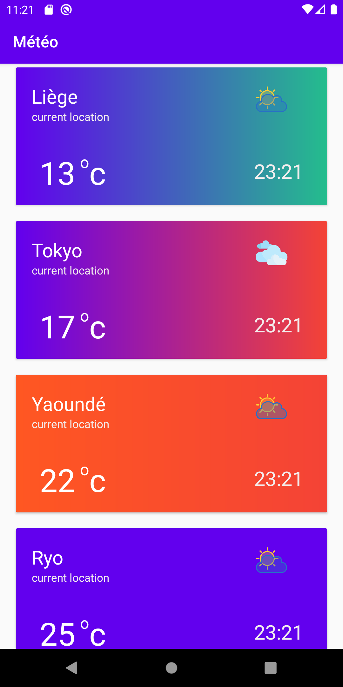
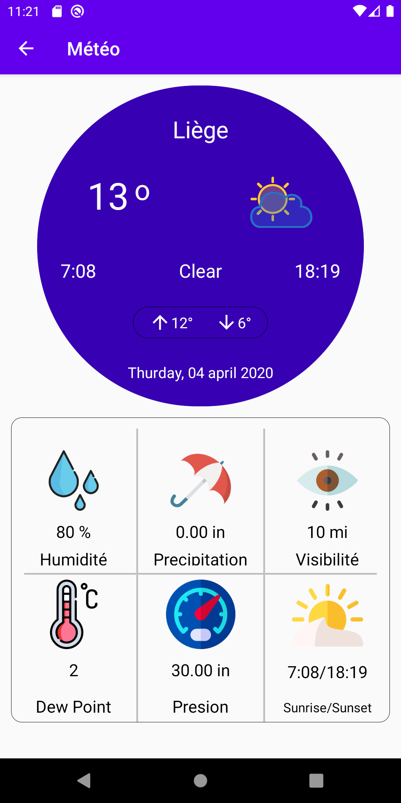

# Projet App mobile JAVA  Meteo
## Descriptif
Projet d'application mobile météo

* Utilisation d'un l'API locale ,
* Affiche la météo du jour  des villes de votre choix,
* Possibilité d'ajouter d'autre ville (elles seront sauvegardées en local),
* Posibilité d'avoir des informations plus détaillés sur la méteo d'une ville ( Humidité, Présipitation, Visibilité, Pression, Dew point, Runrise).

## screentshot de l'interface de l'application 

